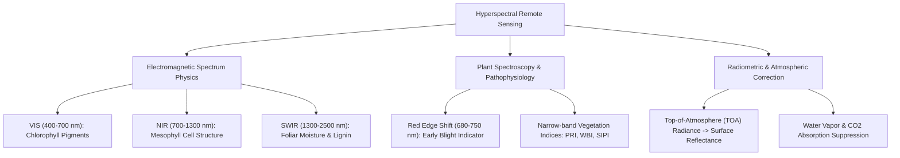

# 🌾 TerraSpectra (Project 1): Professional Engineering & Research Master Blueprint
## Enterprise Architecture, Spectroscopy Science, Data Acquisition & Full Module Guide

---

# 📖 EXECUTIVE SUMMARY & SYSTEM OVERVIEW

**TerraSpectra** is an enterprise-grade, GPU-accelerated Precision Agriculture and Geospatial Computer Vision platform.

### The Engineering Challenge
Conventional crop health monitoring systems utilize 3-channel RGB (Red, Green, Blue) or 4-channel Multispectral imagery (e.g., NDVI using Near-Infrared). These systems operate on a major flaw: **they can only detect crop diseases after leaves visually turn yellow or brown (chlorosis and necrosis)**. By the time visual symptoms appear to human eyes or standard 2D Convolutional Neural Networks (2D-CNNs), internal cellular structures have already collapsed, making harvest yield loss unrecoverable.

Furthermore, standard 2D-CNN architectures treat image input as flat 2D spatial matrices with a few color channels. They are fundamentally incapable of modeling the **3D spatial-spectral volume** of Hyperspectral Data Cubes, which contain hundreds of narrow, contiguous spectral bands.

### The TerraSpectra Solution
TerraSpectra ingests **3D Hyperspectral Data Cubes** capturing **200+ contiguous spectral bands of light** across 400 nm – 2500 nm. By coupling **3D Convolutional Neural Networks (3D-CNNs)** with **Spectral-Attention Vision Transformers (ViT)**, TerraSpectra detects sub-clinical biochemical anomalies—such as subtle chlorophyll-a/b depletion, anthocyanin spikes, and foliar water stress—predicting fungal blight outbreaks **up to 3 weeks before any visible symptoms manifest on the leaves**.

---

# 🔬 SECTION 1: DOMAIN & PHYSICS RESEARCH (WHAT TO STUDY)

Every software engineer and data scientist working on this project must master the following core domain disciplines:



### 1.1 Electromagnetic Spectrum Physics for Plant Canopy Analysis
Hyperspectral Imaging (HSI) measures light reflectance across hundreds of narrow, contiguous spectral channels (typically 5 nm – 10 nm bandwidths).

* **Visible Spectrum (VIS: 400 nm – 700 nm):**
  * **Blue (400 nm – 500 nm):** Absorbed strongly by Carotenoids and Chlorophyll-a/b.
  * **Green (500 nm – 600 nm):** Reflection peak (~550 nm), giving healthy plants their green color.
  * **Red (600 nm – 700 nm):** Chlorophyll-a absorption peak at 675 nm.
* **The Red Edge Region (680 nm – 750 nm):**
  * The boundary between red absorption and Near-Infrared reflection.
  * **Critical Disease Signature:** When fungal pathogens (e.g., *Phytophthora infestans*) infect a plant, cell wall damage causes a **leftward shift (blue shift)** of the Red Edge toward shorter wavelengths **weeks before foliar chlorosis is visible**.
* **Near-Infrared (NIR: 700 nm – 1100 nm):**
  * Highly reflected by healthy leaf spongy mesophyll cells (45% – 50% reflectance).
  * Fungal blight causes internal cell collapse, dramatically dropping NIR reflectance.
* **Short-Wave Infrared 1 (SWIR-1: 1100 nm – 1400 nm) & SWIR-2 (1400 nm – 2500 nm):**
  * Absorbs light based on foliar moisture, protein, lignin, and cellulose content.
  * Major atmospheric water vapor absorption troughs occur at 1450 nm and 1940 nm.

### 1.2 Radiometric Calibration & Atmospheric Noise Suppression
Satellites measure Top-of-Atmosphere (TOA) Radiance ($L_{\text{TOA}}$). Atmosphere contains water vapor ($H_2O$), carbon dioxide ($CO_2$), and aerosols that scatter and absorb photons.

* **Conversion to Surface Reflectance ($\rho_{\text{surface}}$):**
  Engineers must study radiative transfer models (such as 6S - *Second Simulation of a Satellite Signal in the Solar Spectrum* or FLAASH):
  
  $$\rho_{\text{surface}} = \frac{\pi \cdot (L_{\text{sensor}} - L_{\text{path}})}{\tau_v \cdot (E_0 \cdot \cos(\theta_s) \cdot \tau_s + E_{\text{down}})}$$

---

# 📦 SECTION 2: DATASETS, FILE FORMATS & ACQUISITION GUIDE

### 2.1 Standard Data File Formats
1. **HDF5 (`.h5` / `.hdf5`):** Hierarchical Data Format. Stores 3D arrays as datasets alongside attributes (CRS, Bounding Box, Sensor Type).
2. **GeoTIFF (`.tif` / `.tiff`):** Raster format with GeoKeys specifying CRS and Affine Transform matrix mapping pixel $(x, y)$ to real GPS coordinates.
3. **ENVI Header Format (`.hdr` + `.dat`/`.img`):** ASCII header file specifying samples, lines, bands, interleave mode (`BSQ`, `BIL`, `BIP`), and wavelength values.

### 2.2 Open-Source Hyperspectral Satellite Data Sources

| Sensor / Mission | Agency / Source | Bands | Resolution | Data Access Link |
| :--- | :--- | :--- | :--- | :--- |
| **AVIRIS / AVIRIS-NG** | NASA JPL | 224 bands (380 – 2510 nm) | 4 m – 20 m airborne | [aviris.jpl.nasa.gov](https://aviris.jpl.nasa.gov/) |
| **EO-1 Hyperion** | NASA / USGS | 242 bands (357 – 2576 nm) | 30 m spaceborne | [earthexplorer.usgs.gov](https://earthexplorer.usgs.gov/) |
| **PRISMA** | ASI (Italian Space Agency) | 240 bands (400 – 2500 nm) | 30 m spaceborne | [prisma.asi.it](https://prisma.asi.it/) |
| **EnMAP** | DLR (German Aerospace) | 224 bands (420 – 2450 nm) | 30 m spaceborne | [enmap.org](https://www.enmap.org/) |
| **Indian HySI** | ISRO | 64 bands (400 – 950 nm) | 500 m spaceborne | [bhuvan.nrsc.gov.in](https://bhuvan.nrsc.gov.in/) |

---

# 📐 SECTION 3: MATHEMATICAL & ALGORITHMIC FORMULAS

### 3.1 Principal Component Analysis (PCA) Math
1. **Flatten 3D Tensor:** $C \in \mathbb{R}^{H \times W \times B} \longrightarrow X \in \mathbb{R}^{N \times B}$ where $N = H \cdot W$.
2. **Mean Centering:** $\bar{X} = X - \mu$.
3. **Covariance Matrix:** $\Sigma = \frac{1}{N - 1} \bar{X}^T \bar{X} \in \mathbb{R}^{B \times B}$.
4. **Eigendecomposition:** $\Sigma V = V \Lambda \quad (\text{Eigenvalues } \lambda_1 \ge \lambda_2 \ge \dots \ge \lambda_B)$.
5. **Cumulative Explained Variance Ratio:** $\text{EVR}(k) = \frac{\sum_{i=1}^k \lambda_i}{\sum_{j=1}^B \lambda_j} \ge 0.985$.
6. **Projection:** $Z = \bar{X} V_k \in \mathbb{R}^{N \times k} \longrightarrow C_{\text{reduced}} \in \mathbb{R}^{H \times W \times k}$.

### 3.2 Narrow-Band Vegetation Indices (VIs)
* **Photochemical Reflectance Index (PRI):** $\text{PRI} = \frac{R_{531} - R_{570}}{R_{531} + R_{570}}$
* **Water Band Index (WBI):** $\text{WBI} = \frac{R_{970}}{R_{900}}$
* **Structure Insensitive Pigment Index (SIPI):** $\text{SIPI} = \frac{R_{800} - R_{445}}{R_{800} - R_{680}}$

---

# 📦 SECTION 4: FULL MODULES & LIBRARIES TO DOWNLOAD (WITH EXPLICIT "WHY")

### 🐍 Python Backend & Data Science Libraries

```bash
pip install rasterio h5py netCDF4 scikit-learn torch torchvision timm captum fastapi uvicorn pydantic scipy geopandas shap
```

| Package Name | Installation Command | Technical Justification ("WHY It Is Needed") |
| :--- | :--- | :--- |
| **`rasterio`** | `pip install rasterio` | **Geospatial Raster I/O:** Reads GeoTIFF files, extracts Affine Transform matrices, handles Coordinate Reference Systems (CRS: EPSG:4326/3857), and performs bounding box spatial queries. |
| **`h5py`** | `pip install h5py` | **HDF5 File Interface:** Ingests 3D Hyperspectral Data Cubes (`.h5` files from NASA AVIRIS/Hyperion), extracts spectral band metadata attributes, and performs slice indexing without loading full multi-gigabyte datasets into RAM. |
| **`netCDF4`** | `pip install netCDF4` | **Network Common Data Form:** Ingests Copernicus Sentinel satellite NetCDF files (`.nc`) containing multi-dimensional environmental and spectral array layers. |
| **`scikit-learn`** | `pip install scikit-learn` | **Dimensionality Reduction & Metrics:** Implements `sklearn.decomposition.PCA` and `IncrementalPCA` to compress 200+ spectral bands down to 32 components while retaining >98.5% variance. Also provides classification evaluation metrics (`f1_score`, `roc_auc_score`). |
| **`torch` (PyTorch)** | `pip install torch` | **Deep Learning Framework:** Implements GPU-accelerated 3D Convolutional layers (`nn.Conv3d`), custom DataLoaders, CUDA tensor math, and autograd backpropagation loops for early blight classification. |
| **`torchvision`** | `pip install torchvision` | **Vision Transforms & Datasets:** Handles tensor normalization, data augmentation, spatial transforms, and image tensor preprocessing pipelines. |
| **`timm`** | `pip install timm` | **PyTorch Image Models:** Provides pretrained Vision Transformer (ViT) and Swin Transformer backbones adapted for spectral self-attention feature extraction. |
| **`captum`** | `pip install captum` | **Explainable AI (XAI):** Implements Integrated Gradients and DeepLIFT to extract feature attribution scores across spectral wavelengths, proving *which exact nanometer bands* triggered the disease alert. |
| **`fastapi`** | `pip install fastapi` | **High-Performance Async REST API:** Web framework for the backend prediction server. Provides automatic OpenAPI/Swagger documentation, async endpoint handling, and Pydantic request validation. |
| **`uvicorn`** | `pip install uvicorn` | **ASGI Web Server:** Lightning-fast production server running the FastAPI application with multi-worker process management. |
| **`pydantic`** | `pip install pydantic` | **Data Validation:** Enforces strict type checking for API JSON payloads, coordinate bounding boxes, and metadata DTOs. |
| **`geopandas`** | `pip install geopandas` | **Geospatial Vector Engine:** Handles GeoJSON, Shapefiles, spatial joins, and GIS polygon intersection checks for farm field boundaries. |
| **`scipy`** | `pip install scipy` | **Scientific & Spectral Algorithms:** Used for Savitzky-Golay spectral smoothing filters, curve fitting, and optimization algorithms. |
| **`shap`** | `pip install shap` | **Shapley Additive Explanations:** Computes game-theoretic feature attributions for model predictions. |

---

### 🌐 Node.js & React Frontend GIS Libraries

```bash
npm install react react-dom @deck.gl/core @deck.gl/layers @deck.gl/geo-layers @deck.gl/react mapbox-gl react-map-gl lucide-react plotly.js-dist-min react-plotly.js tailwindcss vite
```

| Package Name | Installation Command | Technical Justification ("WHY It Is Needed") |
| :--- | :--- | :--- |
| **`react` & `react-dom`** | `npm install react react-dom` | **UI Library:** Core React 18 component framework for building the user interface, reactive state management, and component lifecycle control. |
| **`@deck.gl/core`** | `npm install @deck.gl/core` | **WebGL GIS Engine:** High-performance WebGL-powered data visualization engine capable of rendering millions of geospatial pixels directly on GPU. |
| **`@deck.gl/layers`** | `npm install @deck.gl/layers` | **Core GIS Layers:** Provides `BitmapLayer` and `GeoJsonLayer` to overlay disease probability heatmaps directly on top of satellite basemaps. |
| **`@deck.gl/geo-layers`** | `npm install @deck.gl/geo-layers` | **Advanced GIS Tile Layers:** Provides `TileLayer` for rendering pyramid raster map tiles dynamically as the user zooms and pans across farm zones. |
| **`@deck.gl/react`** | `npm install @deck.gl/react` | **Deck.gl React Wrapper:** Bridges WebGL Deck.gl canvas rendering with React component state. |
| **`mapbox-gl`** | `npm install mapbox-gl` | **Mapbox Web Engine:** Renders 3D satellite topography, terrain elevation maps, and high-resolution global satellite imagery basemaps. |
| **`react-map-gl`** | `npm install react-map-gl` | **React Wrapper for Mapbox:** Syncs Mapbox viewport state (`longitude`, `latitude`, `zoom`, `pitch`, `bearing`) seamlessly with React components. |
| **`plotly.js-dist-min` & `react-plotly.js`** | `npm install plotly.js-dist-min react-plotly.js` | **Spectral Curve Charting:** Renders interactive 224-band continuous reflectance line charts in the UI sidebar when an analyst clicks on any farm pixel. |
| **`lucide-react`** | `npm install lucide-react` | **UI Icons:** Modern SVG icon library for GIS controls, alert badges, layer toggles, and status indicators. |
| **`tailwindcss`** | `npm install -D tailwindcss postcss autoprefixer` | **Utility-First CSS:** Rapid styling for dark-mode glassmorphism cards, responsive sidebars, and control panels. |
| **`vite`** | `npm install -D vite @vitejs/plugin-react` | **Build Tool & Dev Server:** Next-generation frontend build tool providing instant Hot Module Replacement (HMR) and optimized TypeScript bundling. |

---

# 🚀 SECTION 5: 6-PHASE ENGINEERING EXECUTION ROADMAP

### 🔹 Phase 1: Research & Data Acquisition
1. Acquire AVIRIS/Hyperion sample datasets or generate synthetic 224-band HDF5 files.
2. Verify spectral reflectance curves (400 nm – 2500 nm) for healthy crops vs infected blight zones.
3. Obtain Mapbox API Access Token from [mapbox.com](https://www.mapbox.com/).

### 🔹 Phase 2: Data Ingestion & Dimensionality Reduction
1. Implement `HyperspectralDataLoader` to parse `.h5` and `.tif` files with `h5py` and `rasterio`.
2. Implement `SpectralPCAReducer` using `sklearn.decomposition.PCA` to reduce 224 bands $\rightarrow 32$ components (>98.5% variance retained).
3. Compute narrow-band Vegetation Indices (PRI, WBI, SIPI).

### 🔹 Phase 3: AI Model Engineering (PyTorch 3D-CNN + ViT)
1. Build PyTorch 3D-CNN spatial-spectral feature extractor accepting 5D tensors `(Batch, 1, Components, Height, Width)`.
2. Integrate Vision Transformer (ViT) self-attention module to learn inter-band dependencies.
3. Train model on healthy vs infected spatial-spectral samples.

### 🔹 Phase 4: Explainability (XAI) & Validation Audit
1. Implement `Captum` Integrated Gradients to extract wavelength importance scores.
2. Confirm the model's top attribution weights align with the Red Edge shift (680 nm – 750 nm).

### 🔹 Phase 5: Production FastAPI Tiling API
1. Build sliding-window tiling algorithm ($256 \times 256 \times 32$ tensor chunks with 16px overlapping borders).
2. Wrap model in FastAPI async endpoints (`/api/v1/predict/tile`).

### 🔹 Phase 6: Interactive React 18 + Deck.gl 3D GIS Dashboard
1. Scaffold React 18 + Vite + TypeScript application.
2. Build `MapContainer.tsx` integrating Deck.gl `BitmapLayer` / `GeoJsonLayer` over Mapbox GL satellite basemap.
3. Add Plotly.js spectral reflectance chart sidebar and historical timeline slider.
